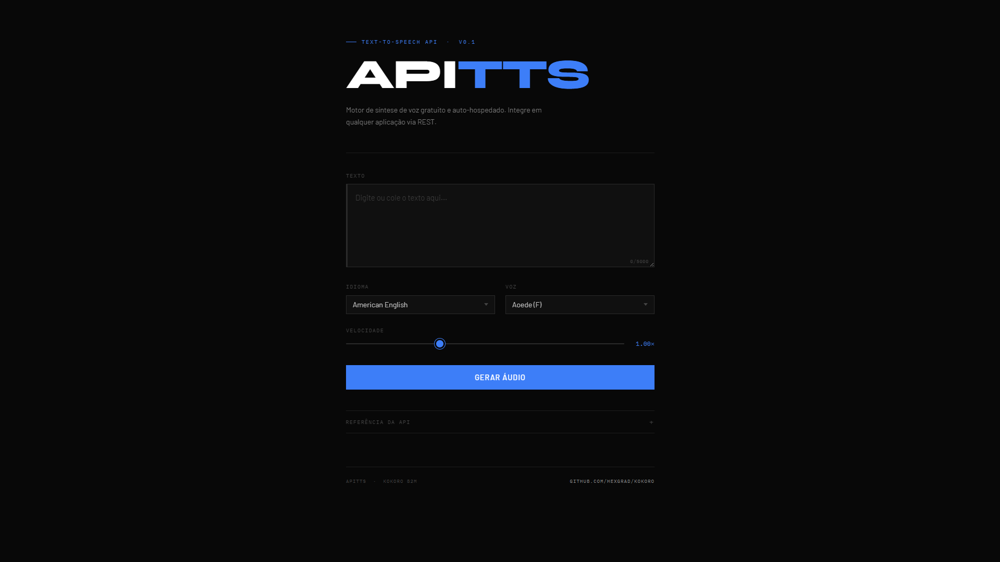

# ApiTTS

Engine de TTS Gratuita e auto-hospedado, construído sobre o [Kokoro TTS](https://github.com/hexgrad/kokoro). Criado com o intuito de ser usado no [Mintalit](https://mintalit.com), mas funciona para qualquer aplicação.

Rode localmente, consuma via API REST, integre onde quiser.



---

## Funcionalidades

- `POST /api/tts` — texto para WAV, pronto para consumir
- `GET /api/voices` — lista idiomas e vozes disponíveis
- 7 idiomas, 32 vozes pré-baixadas (sem download em runtime)
- Velocidade ajustável de 0.5× a 2.0×
- Interface web em `http://localhost:5050`
- CORS habilitado

---

## Requisitos

- Python >= 3.10
- [uv](https://docs.astral.sh/uv/)

---

## Instalação

```bash
git clone https://github.com/seu-usuario/ApiTTS.git
cd ApiTTS
uv sync
```

### Pré-download das vozes

Na primeira vez, baixe todos os arquivos de voz para o cache local (≈ 16 MB). Sem isso, cada voz é baixada na primeira requisição.

```bash
uv run python download_voices.py
```

As vozes ficam em `~/.cache/huggingface/hub/` e são usadas offline nas próximas execuções.

---

## Uso

```bash
uv run python main.py
```

Servidor disponível em `http://localhost:5050`.

---

## API

### `POST /api/tts`

**Corpo (JSON):**

| Campo   | Tipo   | Padrão      | Descrição                           |
|---------|--------|-------------|-------------------------------------|
| `text`  | string | obrigatório | Texto a sintetizar (máx. 5000 chars)|
| `lang`  | string | `"a"`       | Código do idioma                    |
| `voice` | string | primeira    | ID da voz                           |
| `speed` | float  | `1.0`       | Velocidade (0.5 – 2.0)              |

**Resposta:** `audio/wav`

**Idiomas:**

| Código | Idioma               |
|--------|----------------------|
| `a`    | Inglês Americano     |
| `b`    | Inglês Britânico     |
| `p`    | Português Brasileiro |
| `e`    | Espanhol             |
| `f`    | Francês              |
| `i`    | Italiano             |
| `h`    | Hindi                |

**Exemplo:**

```bash
curl -X POST http://localhost:5050/api/tts \
  -H "Content-Type: application/json" \
  -d '{"text":"Olá, mundo!","lang":"p","voice":"pf_dora","speed":1.0}' \
  --output fala.wav
```

**JavaScript:**

```js
const res = await fetch('http://localhost:5050/api/tts', {
  method: 'POST',
  headers: { 'Content-Type': 'application/json' },
  body: JSON.stringify({ text: 'Olá!', lang: 'p', voice: 'pf_dora', speed: 1.0 }),
});
const audio = new Audio(URL.createObjectURL(await res.blob()));
audio.play();
```

---

### `GET /api/voices`

```bash
curl http://localhost:5050/api/voices
```

---

## Vozes disponíveis

| Idioma               | Vozes |
|----------------------|-------|
| Inglês Americano     | `af_heart` `af_bella` `af_nicole` `af_aoede` `af_kore` `af_sarah` `af_sky` `am_adam` `am_echo` `am_eric` `am_fenrir` `am_liam` `am_michael` `am_onyx` `am_puck` |
| Inglês Britânico     | `bf_emma` `bf_isabella` `bm_george` `bm_lewis` |
| Português Brasileiro | `pf_dora` `pm_alex` `pm_santa` |
| Espanhol             | `ef_dora` `em_alex` `em_santa` |
| Francês              | `ff_siwis` |
| Italiano             | `if_sara` `im_nicola` |
| Hindi                | `hf_alpha` `hf_beta` `hm_omega` `hm_psi` |

---

## Licença

MIT
